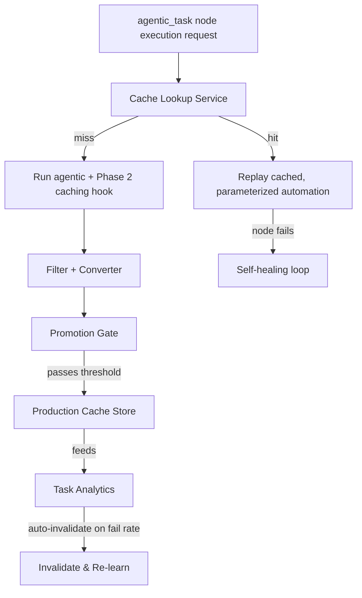

# From POC Cache to Production-Grade Architecture

## Current Architecture (POC)

Per `03_design_decisions_and_tradeoffs.md` §3: a single append-only `cache.jsonl` file on local disk, written once during one agentic run, read once by a manual conversion script, producing one static `test_automation_cached.json`. There is no lookup step - nothing checks "have we cached this before?" before running agentically - and nothing persists past the local filesystem. That scope was correct for a 1-3 hour build; it is not a caching *system*, just a capture-and-convert pipeline. Everything below is the gap between the two.

## Production Requirements

| Gap | Why it matters |
|---|---|
| No lookup-before-run | The POC only caches *after* an agentic run. Production needs to check for an existing cached automation *before* paying for an LLM-driven run at all. |
| No durable, shared store | `cache.jsonl` is local and per-run. Production needs the derived automation available to every future run of the same task, across machines/users. |
| No trust gate | The POC's converter output is used immediately. Blindly replacing an agentic step with a derived automation in live traffic risks silently submitting wrong data if the conversion was subtly wrong - this needs a promotion step before it's trusted unattended. |
| No staleness handling | Sites change. A cached automation that was correct last month can silently start failing (or worse, silently submit wrong data without raising) as the page evolves. |
| No parameterization | The POC's converter bakes the *literal* value from one run (e.g. "myname") into `input_text`. A real cache entry needs to serve the same task with different `input_parameters` values on every run, not just replay the one it was seeded with. |

## Cache Key Design

The naive key is `hash(url + task_text)`. Two refinements matter:

- **Parameterize, don't literal-bake.** Optexity's schema already supports variable substitution ({email[0]}). The POC converter  doesn't do this - it writes `step.value` directly. A production converter needs to correlate each cached step's `value` against the *originating* `agentic_task`'s task string (which itself was built from `input_parameters`, e.g. `"fill full name as {name[0]}"`) and reconstruct the templated form. This turns one seed run into an automation that serves every future value of that parameter, not just the one it happened to see first - the actual point of caching a *workflow*, not a *transcript*.
- **Fingerprint the DOM shape, not just the URL.** The same URL can render meaningfully different DOM for different account states, feature flags, or A/B tests. A mismatched DOM shape correctly misses the cache and falls back to agentic rather than replaying a locator set built for a different page variant.

## Proposed Architecture

The deliberate design choice here: **reuse what Optexity already has** (the automation store behind `Task.automation`, and the existing Task Analytics dashboard) rather
than standing up a parallel cache database and a parallel monitoring system. The new pieces are only the lookup step, the promotion gate, and the parameterization logic in
the converter - everything else already exists in the platform.

## Promotion Gates

Rather than a hard cutover ("replace this agentic node with the cached automation the moment one candidate exists"), the safer production default is:

1. **Shadow mode**: run the candidate automation alongside (or instead of a small percentage of) live agentic traffic for the same task, without letting its result affect the real outcome yet, and compare success/output against the agentic run.
2. **Threshold-based promotion**: once the candidate succeeds N consecutive times (or above some success rate over M attempts) across genuinely different sessions, promote it to be tried first, with agentic as the fallback on failure - not the other way around.
3. **Fallback-first as the permanent steady state, not just a bootstrap phase**: even a "trusted" cached automation should still fall back to agentic on failure and recache the result (this is exactly Phase 7b's self-healing loop, running continuously) rather than ever hard-failing a production workflow because a selector went stale.

This mirrors the same asymmetry already designed into Optexity's own schema - `command` first (deterministic, fast), `prompt_instructions` as an AI fallback when the locator fails. Production caching is that same pattern applied one level up: cached automation first, agentic as the fallback when the cache is wrong.

## Multi-Tenancy

If this platform serves multiple customers/environments against nominally "the same" site, a single global cache entry per `(url, task)` will not generalize - different tenants can have different account states or feature flags producing different DOM shapes. The DOM-fingerprint component of the cache key (Section 3) is the first line of defense; if fingerprints diverge often enough per tenant, the key should be namespaced per tenant rather than assuming a global cache automatically applies everywhere.

## Cache Storage Tiers

The direct answer: **two tiers, not one.**

| Tier | Technology | Holds | Why |
|---|---|---|---|
| Fast lookup | **Redis** (`redis-py`) | A small pointer: `{automation_db_id, status, version}`, plus a success/failure counter per key, with a TTL | Lookup happens on every single `agentic_task` node execution - it needs to be low-latency and shared across every service instance, not a per-process in-memory dict. TTL gives cheap default staleness expiry for free. |
| Source of truth | **Postgres** (same database family already backing Optexity's automation store, per `optexity_codebase_understand.md`) | The full `automation_json`, its `status` (`candidate` / `promoted` / `deprecated`), and version history | The actual JSON is too large and too important to lose to keep only in a cache; Postgres is durable and already exists in the platform - this is not a new database, it's a new *table*. |

This is a standard **cache-aside** pattern: check Redis first; on a pointer hit, fetch the real automation from Postgres by id; on a total miss, run agentic and populate both.

**Why two tiers instead of just one:** Redis is fast because it's memory-based, which is exactly why it's the wrong place to keep the only copy of something you can't afford to lose - it can evict entries under memory pressure and isn't durable across a restart unless configured as a database in its own right (not what it's for here). Postgres is durable and structured (query by status, keep version history) but isn't what you want taking the hit of a lookup on *every single* `agentic_task` node execution. So: Redis holds a cheap, disposable pointer (`{automation_db_id, status, version}`) - if it's lost, the worst case is one redundant agentic run to relearn it. Postgres holds the actual `automation_json`, which represents real, possibly expensive work, and is never at risk of being silently evicted.

**This does introduce one genuinely new piece of infrastructure** - Redis - which the "reuse everything" framing in Section 4 slightly understates. It's called out explicitly here rather than glossed over: everything *except* the fast-lookup layer reuses existing Optexity infrastructure (the automation database, Task Analytics), but a low-latency shared lookup cache is new.

### Bloom Filter Optimization Worth Considering
Not needed for the Assignment or a first production rollout - a Redis `GET` is already fast. This only earns its keep once request volume is high enough that avoiding the network hop to Redis itself matters. Included here because it's a legitimate next optimization, not because the design above requires it.

**The idea:** keep a small, local, in-process Bloom filter on each service instance, refreshed periodically from Postgres. Before even calling Redis, ask the Bloom filter "have we ever cached this key?" - if it says "definitely not," skip straight to the agentic path and never make the Redis call at all.

## Scope Checklist

Everything in `02_implementation_plan.md` Phases 1-7 is meant to be buildable in the 1-3 hour window, including the bonus phases. This document - including Section 7's Redis/Postgres implementation - is intentionally *not* part of that build. It's the answer to "what's next," so the demo has a credible answer for "is this just a script, or does it point somewhere real."
